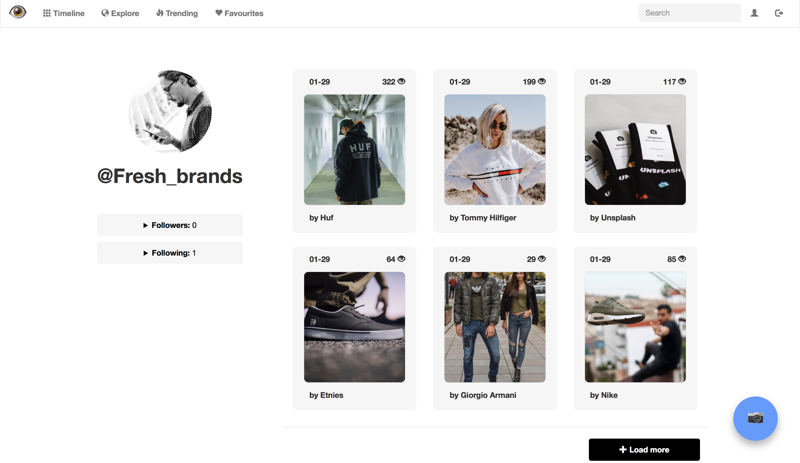
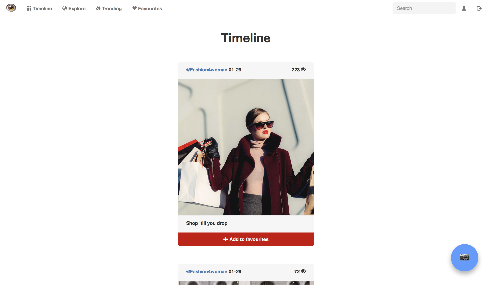

# EyeLike

Groep 20:

- Furkan Simsir

- Hannah Visser

- Luuk Tegel

- Joost de Wildt

## Samenvatting

Eyelike is een webapplicatie met als doel om gebruikers te verbinden die geïnteresseerd zijn in het concept mode. Met behulp van Eyelike kunnen gebruikers foto’s plaatsen die gerelateerd zijn aan mode. Gebruikers kunnen de score van random gegenereerde posts beïnvloeden door de post te liken, disliken of er voor kiezen om de post over te slaan. Afhankelijk van deze waarde kan een post op de trending pagina terechtkomen. Een foto komt op de trending pagina terecht als hij een score heeft van minstens 100 en de afgelopen week geplaatst is. Als een gebruiker foto's wil opslaan om zijn/haar inspiratie te behouden kan een foto toegevoegd worden aan favorieten. Verder is het mogelijk om andere gebruikers te volgen en op de tijdlijn de foto's van de accounts die een gebruiker volgt te bekijken. Eyelike is een uniek online platform, omdat het zich in vergelijking met andere online platforms specialiseert in mode en het aantal volgers op EyeLike geen invloed heeft op de populariteit van een bericht.

## Schermafbeeldingen

## Features

- gebruikers kunnen een account aanmaken

- gebruikers kunnen inloggen op de website

- gebruikers kunnen foto’s op de verkennen pagina liken of disliken

- gebruikers kunnen andere gebruikers volgen en ontvolgen

- gebruikers kunnen via een zoekfunctie andere accounts vinden

- gebruikers kunnen het profiel van andere gebruikers bekijken

- gebruikers kunnen op hun tijdlijn de posts van de gebruikers die ze volgen bekijken

- gebruikers kunnen hun eigen account bekijken

- gebruikers kunnen een profielfoto plaatsen op hun account pagina

- gebruikers kunnen hun profielfoto updaten

- gebruikers kunnen de meest populaire posts bekijken op de trending pagina

- gebruikers kunnen foto’s uploaden met een beschrijving

- gebruikers kunnen foto's opslaan

- gebruikers kunnen opgeslagen foto's bekijken op de favorieten pagina

- gebruikers kunnen opgeslagen foto's van de favorieten pagina verwijderen

- gebruikers kunnen uitloggen

## Minimum Viable Product

Het product moet minimaal voldoen aan een bepaald aantal functies die essentieel zijn voor de website. Zo moet een gebruiker zich kunnen registreren en vervolgens aanmelden op de site. De gebruiker moet verder mensen kunnen volgen en foto’s kunnen plaatsen met een beschrijving en posts van anderen kunnen liken. Daarnaast moet er een tijdelijke profielfoto van de API gehaald kunnen worden, indien de gebruiker zelf nog geen profielfoto heeft ingesteld. Verder moeten gebruikers hun eigen profiel, profielen van anderen en een tijdlijn kunnen zien. Tot slot moet er een trending pagina zijn waar elke gebruiker bij kan om te zien welke posts het meest geliked worden.

## Afhankelijkheden

**Databronnen:**

- [https://unsplash.com] voor de achtergronden op het inlogscherm en de API.

**Externe componenten:**

- Bootstrap voor de opmaak en functionaliteiten van de website

**Concurrerende websites:**

- Tumblr

- Pinterest

- Weheartit

- Tinder

- Instagram

Deze websites zijn geen directe concurrentie, aangezien er nog geen grote website is die alleen draait om mode. Verder onderscheidt onze website zich doordat men alleen foto’s kan beoordelen die op de verkennen pagina staan. Dit voorkomt dat het volgersaantal van een account invloed heeft op de hoogte van de waarde van een post en daarmee dus invloed heeft op het komen van de trending pagina. Het is namelijk alleen op de verkennen pagina mogelijk een beoordeling te geven aan een foto. Dit heeft tot gevolg dat de foto's op de trending pagina een goede afspiegeling is van wat de gebruikers van EyeLike op dit moment leuk vinden.

**Moeilijkste delen:**

- Een moeilijk onderdeel van de website is het implementeren van de API, aangezien deze alleen moet worden aangeroepen als een gebruiker nog geen profielfoto heeft.

- Een ander struikelblok is het ervoor zorgen dat als de gebruiker is ingelogd hij niet dezelfde foto's ziet op de random pagina. Anders zou het voor de gebruiker mogelijk zijn één foto meerdere keren te beoordelen.

- Het volgsysteem implementeren is een lastige functie aangezien er ook gezorgd moet worden dat, zodra een gebruiker een andere gebruiker volgt, gebruikers ontvolgt kunnen worden. Dit moet dan ook weer uit de database verwijderd worden.

- Het maken van de tijdlijn is ook een uitdaging. Hierop verschijnen de foto's van iedereen die de ingelogde gebruiker volgt.

## Sanity Check

Ons voorstel voldoet aan de projecteisen. Het is op EyeLike namelijk mogelijk foto’s te posten met of zonder beschrijving, andere gebruikers te volgen en uploads van elkaar te liken. Daarnaast is er gebruik gemaakt van een API die ervoor zorgt dat gebruikers altijd een profielfoto hebben.

## Taakverdeling

Luuk en Hannah hebben voornamelijk gewerkt aan delen van de html pagina's met onder andere Ajax en Furkan en Joost hebben de meeste tijd gestoken in het schrijven van de functies in helpers. Furkan heeft daarnaast de css gemaakt en iedereen heeft een bijdrage geleverd aan de routes op de application pagina.

## Uitleg repository

In de repository zijn verschillende mapjes te vinden. In het mapje static bevindt zich de css van de website en het grootste deel van de javascript waar mee gewerkt is. Bij de templates zijn alle html pagina's te vinden. Op een aantal pagina's is hier ook javascript met ajax aanwezig, verder is hier jinja en json te vinden. Daarnaast zijn er de mapjes upload, uploadprofilepic en docs. Hierin bevinden zich respectievelijk de geuploade foto's omtrent mode, de profielfoto's die gebruikers geupload hebben en de schermafbeeldingen van de website. De helpers.py bevat alle algemene functies die in meerdere gevallen gebruikt kunnen worden. Velen van deze functies verwijzen naar de database. In de application.py staan alle app routes van de website en in enkele van deze routes worden functies aangeroepen van helpers.py.

